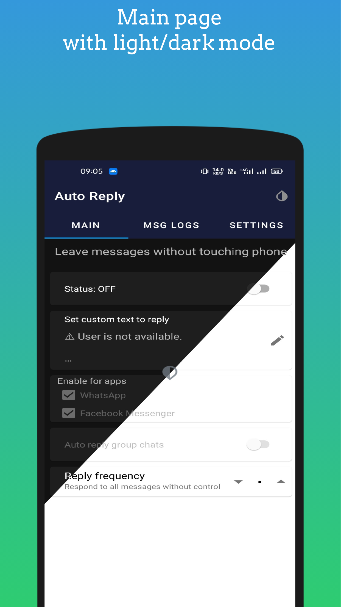
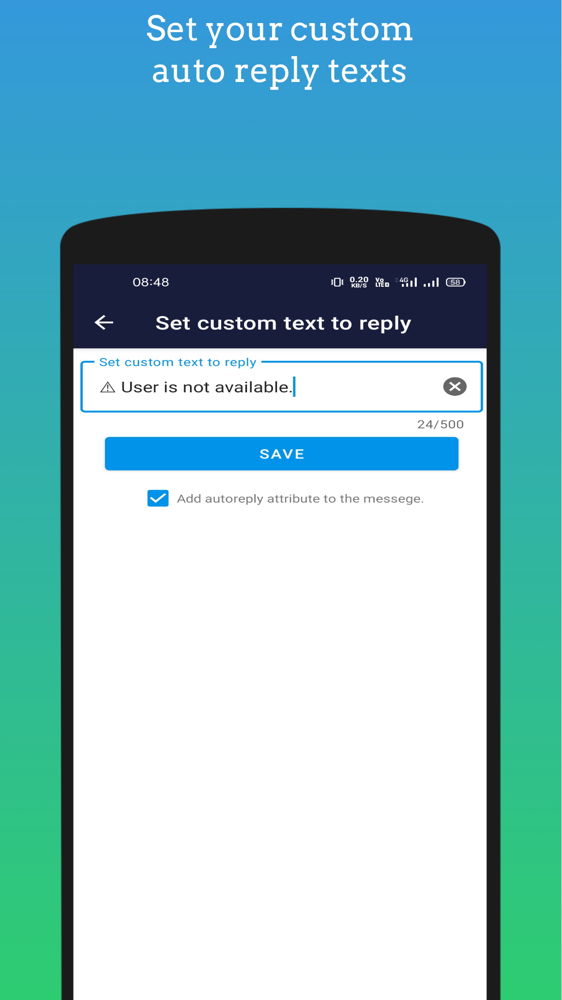
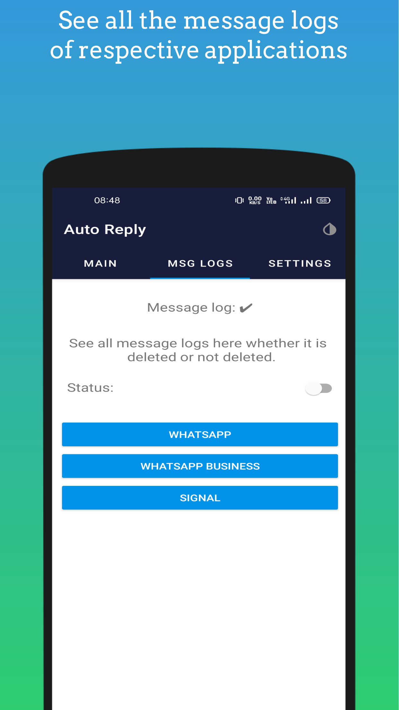
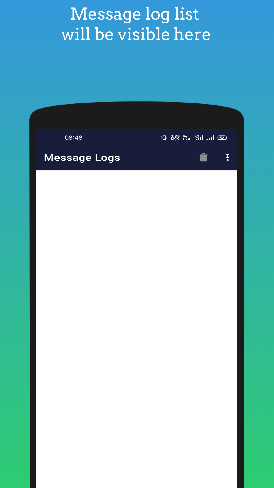
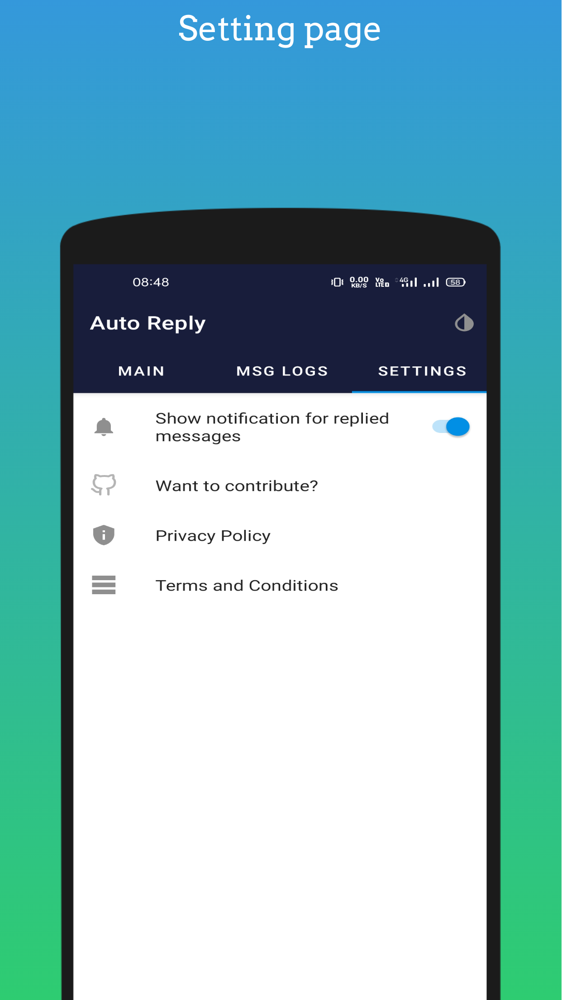

# AutoReply: An Automatic Messaging App

AutoReply is an application designed to provide an automatic reply service for instant messaging platforms. With this app, you can save time and effort by setting up automated responses for messages received on platforms like WhatsApp and Facebook Messenger. 

You can download the app from the Play Store by clicking the following link:

<a href='https://play.google.com/store/apps/details?id=com.matrix.autoreply&pcampaignid=pcampaignidMKT-Other-global-all-co-prtnr-py-PartBadge-Mar2515-1'></a>

The app instantly replies to incoming messages, allowing you to stay connected without physically interacting with your phone. Whether you're away on vacation, sleeping, or simply busy, Auto-Reply-Android ensures that your contacts receive timely responses. You have the flexibility to customize your replies and adjust the frequency with which certain users receive specific messages.

## 💰 You can help me by Donating
[](https://buymeacoffee.com/prasoonk187)

## Screenshots

Here are some screenshots of the app's interface:

| Main Page                                                 | Custom Reply                                              | Logs Section                                      | Logs Viewer                                               | Settings                                                  |
|-----------------------------------------------------------|-----------------------------------------------------------|---------------------------------------------------|-----------------------------------------------------------|-----------------------------------------------------------|
|  |  |  |  |  |

## Features

AutoReply offers the following features:

- Automated replies for both individual and group chats
- Respect for your privacy by not collecting any personal information
- Ability to set reply frequencies for individual users
- Message log storage, even if messages are deleted for everyone
- No tracking or monitoring of user activities
- Free to use
- In-app updates using Play Core
- Open-source nature, available on [GitHub](https://www.github.com/it5prasoon/Auto-Reply-Android)

## ToDo

Here are the tasks in progress and planned for future development:

- Implement Dependency Injection using Dagger
- UI improvements
- Refactor code according to MVVM

## Tech Stack & Open-source Libraries

AutoReply is built using the following technologies and open-source libraries:

- Kotlin programming language
- Firebase for backend functionality
- Notification listener services
- Retrofit client for network communication
- Coroutines for asynchronous programming
- RoomDb for local data storage

## To Start with building in Local

- Add firebase ```google-services.json``` in src/main.
- Add a file ```ad_mob_config.xml``` to configure AdMob.
```xml
<?xml version="1.0" encoding="utf-8"?>
<resources>
    <string name="admob_app_id">your_app_id</string>
    <string name="msg_logs_banner">your_banner_id</string>
    <string name="main_banner">your_banner_id</string>
    <string name="save_custom_reply_interstitial">your_interstitial_id</string>
</resources>

```

## Contribution Guidelines

- Fork the repository, do code changes and then do a pull request.
- If your PR is approved then you are good to go.

## Important Note

When the application sends a reply to a specific user, it waits for a 10-second interval before sending the next reply (unless the reply frequency is set to 1). Please note that this delay does not indicate any issues with the application's functionality.

For the source code and contributions, please visit the [AutoReply GitHub repository](https://www.github.com/it5prasoon/Auto-Reply-Android).

The application is currently in the development phase, and your code contributions are greatly appreciated. Feel free to fork the repository and make pull requests. We look forward to your collaboration.

Please note that this application is not affiliated with any company, including WhatsApp and Facebook.

For any inquiries or further information, you can contact me at prasoonk187@gmail.com.
