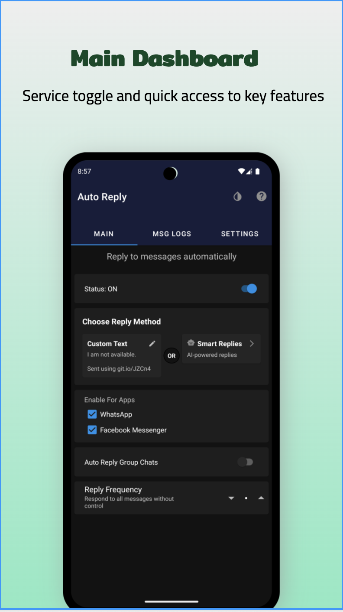
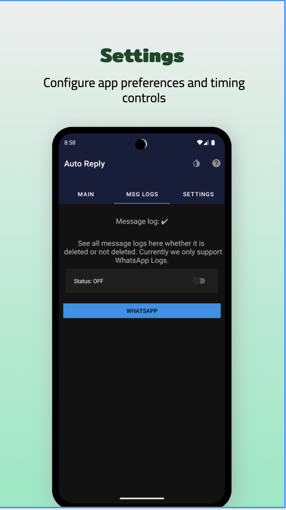

<div align="center">
  <h1>🤖 AutoReply - Custom or AI Smart Messenger</h1>
  <p><strong>Best Free Auto Reply App for WhatsApp, Instagram & Messenger | Automatic Message Responder | AI-Powered Smart Replies</strong></p>
  
  <p>
    <a href="https://play.google.com/store/apps/details?id=com.matrix.autoreply">
      
    </a>
  </p>
  
  <p>
    
    
    
    
  </p>
</div>

## ✨ Overview

**AutoReply** is the #1 free WhatsApp auto reply app for Android that automatically sends messages on WhatsApp, WhatsApp Business, Facebook Messenger, Instagram, and other messaging apps. Perfect for busy professionals, students, and anyone who wants to stay connected 24/7 with automatic message responses.

**Youtube Link:** https://youtube.com/shorts/_Dk9octBRbk?si=5lFMLGUn3D-O7VPB

### 🔥 **Why Choose AutoReply?**
- **100% Free** auto reply for WhatsApp, Instagram & Messenger
- **AI-Powered Smart Replies** with ChatGPT-like responses
- **Multi-Platform Support** - WhatsApp, WhatsApp Business, Instagram DMs, Facebook Messenger
- **No Root Required** - works on all Android devices
- **Privacy First** - your messages stay on your device
- **Works Offline** - no internet required for custom replies

### 🎯 Key Benefits
- **Never miss a message** - Automatic responses keep conversations flowing
- **Customizable replies** - Set personalized messages for different situations  
- **Smart frequency control** - Avoid spam with intelligent reply timing
- **Privacy focused** - No data collection or tracking
- **Completely free** - Open source with no ads or premium features

## 📱 Screenshots

<div align="center">
  <table>
    <tr>
      <td></td>
      <td></td>
      <td></td>
      <td></td>
    </tr>
    <tr>
      <td align="center"><strong>Main Dashboard</strong><br/>Service toggle and quick access to key features</td>
      <td align="center"><strong>AI Settings</strong><br/>Enable AI-powered smart replies with provider options</td>
      <td align="center"><strong>AI Provider</strong><br/>Choose between Groq (free) and OpenAI providers</td>
      <td align="center"><strong>Model Selection</strong><br/>Select and configure AI models for responses</td>
    </tr>
  </table>
  
  <table>
    <tr>
      <td></td>
      <td></td>
      <td></td>
      <td></td>
    </tr>
    <tr>
      <td align="center"><strong>Custom Prompts</strong><br/>Personalize AI behavior with system instructions</td>
      <td align="center"><strong>Custom Replies</strong><br/>Create and manage personalized auto-reply messages</td>
      <td align="center"><strong>Message Logs</strong><br/>View conversation history and track messages</td>
      <td align="center"><strong>Settings</strong><br/>Configure app preferences and timing controls</td>
    </tr>
  </table>
</div>

## 💰 Support the Project

<div align="center">
  <a href="https://buymeacoffee.com/prasoonk187">
    
  </a>
</div>


## 📱 Supported Platforms

<div align="center">
  <table>
    <tr>
      <td align="center" width="33%">
        
        <br><strong>WhatsApp & Business</strong>
        <br>Full auto-reply support for individual and group chats on both regular WhatsApp and WhatsApp Business
      </td>
      <td align="center" width="33%">
        
        <br><strong>Instagram</strong>
        <br>Auto-reply for Instagram Direct Messages
      </td>
      <td align="center" width="33%">
        
        <br><strong>Facebook Messenger</strong>
        <br>Automatic responses for Messenger conversations
      </td>
    </tr>
  </table>
</div>

## 🎆 Features

<div align="center">
  <table>
    <tr>
      <td align="center">
        <h3>🤖 Smart AI Replies</h3>
        <p>AI-powered responses with Groq & OpenAI support</p>
      </td>
      <td align="center">
        <h3>💬 Custom Responses</h3>
        <p>Set your own automated reply messages</p>
      </td>
      <td align="center">
        <h3>✨ AI Prompt Templates</h3>
        <p>10 pre-made personality styles or create your own</p>
      </td>
    </tr>
    <tr>
      <td align="center">
        <h3>🧠 Conversational Context</h3>
        <p>AI remembers conversation history for coherent multi-turn chats</p>
      </td>
      <td align="center">
        <h3>📊 Analytics Dashboard</h3>
        <p>Track daily replies, totals, and AI vs Custom usage</p>
      </td>
      <td align="center">
        <h3>🔒 Privacy First</h3>
        <p>No data collection or tracking of your activities</p>
      </td>
    </tr>
    <tr>
      <td align="center">
        <h3>⏱️ Reply Delay Control</h3>
        <p>Configurable 1-10 second delay for natural responses</p>
      </td>
      <td align="center">
        <h3>📁 Message Logs</h3>
        <p>Keep records even if messages are deleted</p>
      </td>
      <td align="center">
        <h3>💼 WhatsApp Business</h3>
        <p>Full support for WhatsApp Business accounts</p>
      </td>
    </tr>
    <tr>
      <td align="center" colspan="3">
        <h3>🆓 Completely Free</h3>
        <p>No ads, no premium features, open source</p>
      </td>
    </tr>
  </table>
</div>

## 🛠️ Tech Stack

<div align="center">
  <table>
    <tr>
      <td align="center">
        
      </td>
      <td align="center">
        
      </td>
      <td align="center">
        
      </td>
    </tr>
    <tr>
      <td align="center">
        
      </td>
      <td align="center">
        
      </td>
      <td align="center">
        
      </td>
    </tr>
  </table>
</div>

### 📚 Libraries & Components
- **Kotlin** - Modern programming language
- **AI Integration** - Groq & OpenAI API support
- **Firebase** - Backend services and analytics
- **Room Database** - Local data storage
- **Retrofit** - Network communication
- **Coroutines** - Asynchronous programming
- **Notification Listener** - Core messaging functionality

## 🆕 What's New

### 🧠 Conversational Context (AI Memory)
The AI now remembers your conversation history for more natural, coherent responses:
- **Multi-turn conversations** - AI maintains context across multiple messages per user
- **Per-user isolation** - Each contact has their own separate conversation context
- **Auto session management** - Sessions automatically expire after 30 minutes of inactivity
- **Active contexts indicator** - See how many conversations are currently active on dashboard
- **Smarter responses** - AI can reference previous messages for more relevant replies

### ⏱️ Configurable Reply Delay
Control how quickly auto-replies are sent with natural timing:
- **Adjustable 1-10 seconds** - Set your preferred delay from main dashboard
- **Default 3 seconds** - Natural, human-like response timing
- **Prevents spam detection** - Avoids triggering platform anti-spam measures
- **More realistic conversations** - Replies don't appear instant/robotic

### 💼 WhatsApp Business Support
Full auto-reply functionality for business accounts:
- **Separate app support** - Works alongside regular WhatsApp
- **Business-specific filtering** - View WA Business logs separately in MSG LOGS
- **Professional use cases** - Perfect for business owners and customer support
- **Same great features** - AI replies, custom messages, analytics all work seamlessly

### AI Prompt Templates System
Choose from 10 pre-made personality styles or create your own:
- ✏️ **Custom Prompt** - Blank slate for complete customization
- 😊 **Friendly & Casual** - Warm, approachable responses
- 💼 **Professional** - Formal, business-appropriate tone
- ⏰ **Busy Person** - Quick acknowledgments
- 😄 **Humorous & Fun** - Light-hearted, witty responses
- 💙 **Supportive & Caring** - Empathetic, understanding
- ✓ **Minimal Responder** - Short, to-the-point (1-3 words)
- 🎉 **Enthusiastic** - Energetic, positive vibes
- 📚 **Academic/Student** - Scholarly, study-focused
- 🚀 **Entrepreneur/Hustler** - Business-focused, goal-oriented

**All templates are fully editable** - Select any template and customize it to match your exact needs!

### AI Prompt Generator
Use AI to refine your prompts with natural language:
- Click "✨ AI Generate" button in prompt editor
- Describe how you want to modify the prompt
  - "Make it more professional"
  - "Add humor and warmth"
  - "Keep responses under 15 words"
  - "Sound like a busy entrepreneur"
- AI generates an improved version instantly
- Uses your existing API key - no additional setup!

### Analytics Dashboard
Track your auto-reply activity directly on the main screen:
- 📊 **Today's Replies** - See how many replies sent today
- 📈 **Total Replies** - All-time counter since installation
- 🤖 **AI vs Custom** - Breakdown of reply types used
- 📱 **Per-App Tracking** - WhatsApp, Instagram, Messenger stats
- 🔥 **Firebase Analytics** - Detailed insights and usage patterns

### 🛡️ Anti-Scam Safety Protection
Optional protection against fraudulent and suspicious messages:
- **Money scam detection** - AI refuses to agree to money requests, debt claims, payment demands
- **Threat protection** - Deflects threats and violence-related messages
- **OTP/password safety** - Never shares sensitive information like OTPs or passwords
- **Language-agnostic** - Works in any language the user communicates in
- **User-controlled** - Enable/disable in AI Settings → Safety Protection
- **Confused responses** - AI responds with "What money? Wrong person maybe" instead of agreeing

## 📋 Roadmap

- [x] **AI-Powered Smart Replies** - Groq & OpenAI integration
- [x] **Dual Provider Support** - Free (Groq) and Premium (OpenAI) options
- [x] **Custom System Messages** - Personalize AI behavior
- [x] **Instagram Support** - Auto-reply for Instagram Direct Messages
- [x] **AI Prompt Templates** - 10 pre-made personality styles (Friendly, Professional, Humorous, etc.)
- [x] **AI Prompt Generator** - Use AI to refine and customize prompts
- [x] **Analytics Dashboard** - Track daily/total replies and usage metrics
- [x] **Firebase Analytics** - Detailed event tracking for insights
- [x] **WhatsApp Business Support** - Full auto-reply for WA Business accounts
- [x] **Configurable Reply Delay** - 1-10 second adjustable delay for natural responses
- [x] **Conversational Context** - AI remembers conversation history for multi-turn chats
- [x] **Anti-Scam Safety Protection** - Optional protection against money scams, threats, and suspicious messages
- [ ] Implement Dependency Injection (Dagger/Hilt)
- [ ] UI/UX improvements and Material Design 3
- [ ] MVVM architecture refactoring
- [ ] Multi-language support expansion
- [ ] Advanced scheduling features
- [ ] Support for additional messaging platforms (Telegram, Slack, Discord)
- [ ] Contact-specific rules and VIP contacts

## 🚀 Getting Started

### Prerequisites
- Android Studio Arctic Fox or newer
- Android SDK 23+
- Kotlin 1.9+

### 🔧 Setup Instructions

1. **Clone the repository**
   ```bash
   git clone https://github.com/it5prasoon/Auto-Reply-Android.git
   cd Auto-Reply-Android
   ```

2. **Configure Firebase**
   - Add your `google-services.json` file to `app/src/main/`
   - Get it from [Firebase Console](https://console.firebase.google.com/)

3. **Configure AdMob (Optional)**
   - Create `app/src/main/res/values/ad_mob_config.xml`:
   ```xml
   <?xml version="1.0" encoding="utf-8"?>
   <resources>
       <string name="admob_app_id">your_app_id</string>
       <string name="msg_logs_banner">your_banner_id</string>
       <string name="main_banner">your_banner_id</string>
       <string name="save_custom_reply_interstitial">your_interstitial_id</string>
       <string name="ai_enable_interstitial">your_ai_interstitial_id</string>
       <string name="ai_settings_banner">your_ai_banner_id</string>
   </resources>
   ```

4. **Configure AI Settings (Optional)**
   - Enable Smart Replies in the app
   - Choose between Groq (Free) or OpenAI (Paid)
   - Get API key from provider console
   - Customize system message for AI behavior

5. **Build and Run**
   ```bash
   ./gradlew assembleDebug
   ```

## 🤝 Contributing

We welcome contributions! Here's how you can help:

1. **Fork** the repository
2. **Create** a feature branch (`git checkout -b feature/amazing-feature`)
3. **Commit** your changes (`git commit -m 'Add amazing feature'`)
4. **Push** to the branch (`git push origin feature/amazing-feature`)
5. **Open** a Pull Request

### 📜 Contribution Guidelines
- Follow Kotlin coding conventions
- Write clear commit messages
- Test your changes thoroughly
- Update documentation if needed

## ⚠️ Important Notes

- **Reply Delay**: Configurable 1-10 second delay (default 3s) before sending replies for natural conversation flow
- **Conversational Context**: AI conversation sessions auto-expire after 30 minutes of inactivity
- **Privacy**: This app is not affiliated with WhatsApp, Facebook, or any messaging platform
- **Permissions**: Notification access is required for the app to function properly

## 📞 Support & Contact

<div align="center">
  <p>Need help or have questions?</p>
  
  <a href="mailto:prasoonkumar008@gmail.com">
    
  </a>
  <a href="https://github.com/it5prasoon/Auto-Reply-Android/issues">
    
  </a>
</div>

## 📜 License

```
MIT License

Copyright (c) 2024 AutoReply

Permission is hereby granted, free of charge, to any person obtaining a copy
of this software and associated documentation files (the "Software"), to deal
in the Software without restriction, including without limitation the rights
to use, copy, modify, merge, publish, distribute, sublicense, and/or sell
copies of the Software, and to permit persons to whom the Software is
furnished to do so, subject to the following conditions:

The above copyright notice and this permission notice shall be included in all
copies or substantial portions of the Software.

THE SOFTWARE IS PROVIDED "AS IS", WITHOUT WARRANTY OF ANY KIND, EXPRESS OR
IMPLIED, INCLUDING BUT NOT LIMITED TO THE WARRANTIES OF MERCHANTABILITY,
FITNESS FOR A PARTICULAR PURPOSE AND NONINFRINGEMENT.
```

---

<div align="center">
  <p><strong>Made with ❤️ by it5prasoon</strong></p>
  <p>If this project helped you, please consider giving it a ⭐️</p>
</div>
